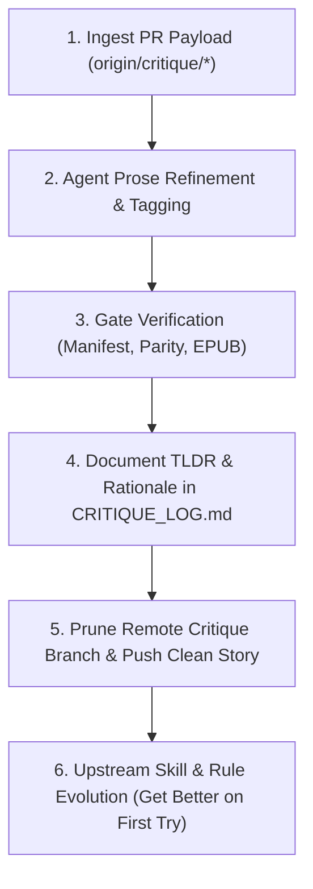

# 🔄 Critique & PR Feedback Pipeline Skill

The `critique-pipeline` skill automates the complete intake-to-publish feedback lifecycle for D&D Scribe campaigns.

---

## 🏗️ The 6-Stage Continuous Learning Lifecycle



1. **Intake & Polling:** Scans remote branches for `critique/*` generated by the GitHub Pages eBook & Critique Reader, saving payloads to `sessions/data/critiques/`.
2. **Narrative Rewriting & Alias Tuning:** Refines prose for flagged anchor blocks, removing tabletop artifacts and updating speaker alias detection.
3. **Verification Testing:** Runs `verify_manifest.py`, `verify_parity.py`, `generate_web_manifest.py`, and `novel/generate_epub.py` to ensure 100% transcript parity and EPUB3 compliance.
4. **Audit Logging & Justification:** Appends structured change entries into `sessions/data/critiques/CRITIQUE_LOG.md` with explicit rationales and logs potential ambiguities to the **Retcon Watchlist**.
5. **Branch Pruning & Main Sync:** Closes/deletes merged critique branches and pushes canonical novel builds to origin.
6. **Upstream Skill Evolution (Meta-Learning):** Asks *"Why did this draft slip upstream?"* and updates the corresponding skill tooling:
   - **STT Phonetic Glossaries:** Updates character dossiers (`campaign/characters/pcs/`) with known accent transcription corruptions.
   - **Linter Rule Hardening:** Adds checks in `novel-critic` to catch table-reaction particles (`"Wow..."`, `"Oh man..."`) and anime spell-shouts before human review.
   - **Speaker Heuristics:** Expands relational/ordinal aliases in `generate_web_manifest.py`.

---

## 🚀 CLI Commands

### 🔍 Poll for New Feedback Branches
```powershell
python .agents/skills/critique-pipeline/scripts/poll_critique_prs.py --poll
```

### 🧹 Poll, Process & Prune Merged Branches
```powershell
python .agents/skills/critique-pipeline/scripts/poll_critique_prs.py --poll --prune
```

### ⏱️ Recurring Schedule (Cron)
Run via `/schedule` or schedule tool every 6 hours:
```powershell
# Cron Expression: '0 */6 * * *'
python .agents/skills/critique-pipeline/scripts/poll_critique_prs.py --poll --prune
```
