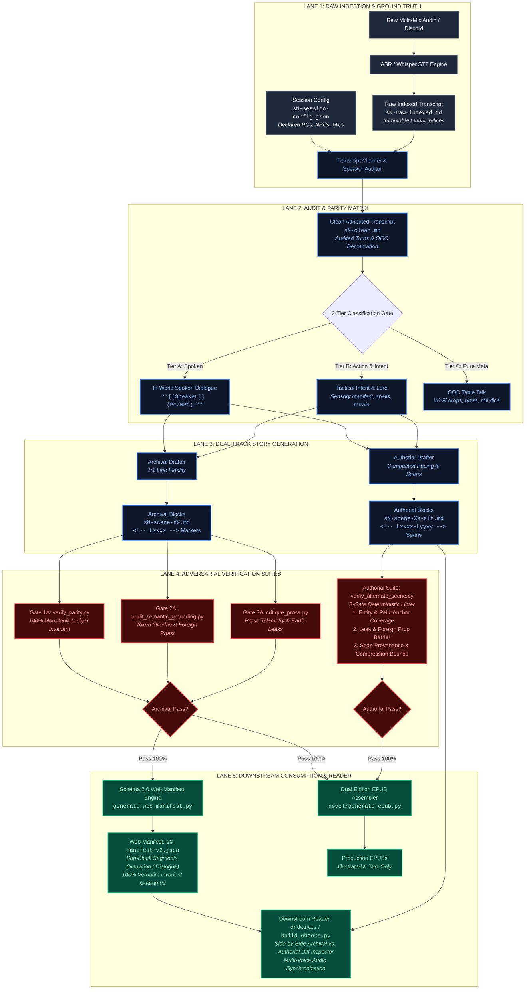

# 🏛️ Architecture Specification: Deterministic & Independent Transcript-to-Publishing Pipeline

## Executive Overview
The **D&D Scribe Publishing Engine** transforms raw, chaotic tabletop RPG session recordings and multi-speaker transcripts into high-fidelity fantasy novels, audiobooks, and web manifests.

To guarantee that the pipeline remains **strictly independent, non-biased, and deterministic**, the system enforces an adversarial gate architecture where no drafting agent evaluates its own output. Prose generation is decoupled from verification, and mathematical invariants govern every transformation.

The publishing engine operates on a **Dual-Track Architecture**:
1. **Track A (Canonical Archival Cut):** 100% Monotonic line-by-line coverage, strict transcript parity, and comprehensive ledger accounting (`rendered=[...] skipped=[...]`).
2. **Track B (Authorial Cut):** Pacing-optimized, compacted scene set-pieces with coarse line spans (`<!-- Lxxxx-Lyyyy -->`) for rapid novelistic momentum while preserving core character emotion, voice, and lore anchors.

---

## 🗺️ Pipeline Architecture: Dual-Track Publishing Engine

---

## ⚖️ How We Maintain Independence, Objectivity & Determinism

### 1. Separation of Concerns (Adversarial Decoupling)
* **The Drafter Never Grades Its Own Paper:** The LLM agents that draft or compress scenes do not write the verification scripts or pass/fail decisions.
* **Deterministic Mathematical Assertions:** Automated gates ([`verify_parity.py`](file:///d:/Code/dnd-scribe/sessions/_scripts/verify_parity.py), [`audit_semantic_grounding.py`](file:///d:/Code/dnd-scribe/sessions/_scripts/audit_semantic_grounding.py), [`verify_manifest.py`](file:///d:/Code/dnd-scribe/sessions/_scripts/verify_manifest.py), [`verify_alternate_scene.py`](file:///d:/Code/dnd-scribe/sessions/_scripts/verify_alternate_scene.py)) run pure Python algorithms with zero model hallucinations:
  $$	ext{Rendered Turns} \cup 	ext{Skipped Turns} = 	ext{All Expected Dialogue Turns}$$
  $$	ext{Rendered Turns} \cap 	ext{Skipped Turns} = \emptyset$$
  Every single line in the raw transcript must be mathematically accounted for in monotonic sequence.

### 2. Zero Hallucination & Anti-Drift Guardrails
* **High-Risk Foreign Prop Checker:** Flags any modern or foreign object introduced into prose that does not exist in the raw transcript window (e.g., cars, helicopters, trucks, laptops, smartphones).
* **Suspicious Cluster Skip Detection:** Automatically halts the pipeline if $\ge 5$ consecutive spoken lines are marked as `(ooc)` skips without justification, ensuring that casual character banter and worldbuilding cannot be silently dropped.
* **Semantic Token Overlap:** For every rendered marker `<!-- Lxxxx -->`, the auditor computes the set intersection of lemmatized, non-stopword tokens between the prose paragraph and a 7-line window in the raw transcript. If token overlap is 0, the build fails with `UNGROUNDED TURN`.

### 3. The 3-Gate Deterministic Alternate Scene Verifier (`verify_alternate_scene.py`)
For Track B (Authorial Cut scenes), we avoid non-deterministic sentiment analysis or arbitrary statistical thresholds. The verifier enforces 3 deterministic checks:
1. **Gate 1: Entity & Relic Anchor Coverage:** Asserts that 100% of active PCs, NPCs, and scene relics (e.g. "daughter's card", "cucumber mask", "pancakes", "limestone") from the archival scene appear in the alternate cut.
2. **Gate 2: Leak, Slang & Foreign Prop Scanner:** Reuses `LeakDetector`, `LoreGuardian`, and `HIGH_RISK_FOREIGN_PROPS` to guarantee zero modern realia or mechanics jargon.
3. **Gate 3: Span Provenance & Compression Integrity:** Validates that `<!-- Lxxxx-Lyyyy -->` spans are monotonically increasing, cover the scene boundary, and do not completely silence any active character from the conversation.

### 4. Downstream Verbatim Contract
* Downstream readers (`dndwikis`, EPUB readers, ElevenLabs TTS pipelines) require exact speaker coloring, line provenance, and sub-block segmentation without risking text mutation.
* **The 100% Verbatim Invariant:**
  $$\sum_{s \in 	ext{block.segments}} s.	ext{text} \equiv 	ext{block}.	ext{text}$$
  Decomposing a paragraph into `"narration"` and `"dialogue"` must reconstruct the original block character-for-character, preserving exact whitespace, em-dashes, and punctuation.

---

## 🔍 Post-Mortem & Failures Experienced (Cross-Referenced with [`CRITIQUE_LOG.md`](file:///d:/Code/dnd-scribe/CRITIQUE_LOG.md))

Our pipeline hardened through resolving real-world failures tracked in [`CRITIQUE_LOG.md`](file:///d:/Code/dnd-scribe/CRITIQUE_LOG.md) and [`sessions/data/critiques/CRITIQUE_LOG.md`](file:///d:/Code/dnd-scribe/sessions/data/critiques/CRITIQUE_LOG.md):

### 1. The "Green Ford Truck" Infiltration Failure (Session 3)
* **Reference:** [`CRITIQUE_LOG.md: PR Record #002`](file:///d:/Code/dnd-scribe/CRITIQUE_LOG.md#L35-L56)
* **Failure Mode:** In early drafting, an upstream agent hallucinated the party driving a modern green Ford farm truck on an asphalt highway to Raleigh, completely erasing the canonical interdimensional travel.
* **Tabletop Ground Truth:** The party entered the **Lost Roads via Theodore's maintenance shed**, met **Ally (Maiden of Persephone)**, and emerged inside the **North Carolina Museum of History broom closet**.
* **Remediation & Permanent Gate:**
  - Added the `HIGH_RISK_FOREIGN_PROPS` filter in [`audit_semantic_grounding.py`](file:///d:/Code/dnd-scribe/sessions/_scripts/audit_semantic_grounding.py) scanning for modern anachronisms (`"truck"`, `"ford"`, `"chevy"`, `"smartphone"`).
  - Added Tier B Lore Drop tracking (`tier_b_pattern`) to prohibit skipping critical keywords (`"lost roads"`, `"maintenance shed"`, `"limestone stele"`).

### 2. Speech-to-Text Phonetic Accent Mergers (Session 1 & Session 3)
* **References:** 
  - *Versailles to Paris:* [`CRITIQUE_LOG.md: PR Record #001`](file:///d:/Code/dnd-scribe/CRITIQUE_LOG.md#L19-L32)
  - *Nincy vs. Nancy:* [`sessions/data/critiques/CRITIQUE_LOG.md: PR Record #003`](file:///d:/Code/dnd-scribe/sessions/data/critiques/CRITIQUE_LOG.md#L9-L24)
* **Failure Mode:** Automatic speech-to-text transcribed Pierre saying *"Versailles to Brittany"* because of hard French phonemes (*"Pair-ey"*), and transcribed the museum receptionist as *"Nancy"* despite her explicit dialogue: *"Nincy with an I... N-I-N-C-Y... Some people with my accent, they don't hear."*
* **Remediation & Permanent Gate:**
  - Created [`audit_transcript_gaps.py`](file:///d:/Code/dnd-scribe/sessions/_scripts/audit_transcript_gaps.py) to harvest self-referential spelling patterns (`"with my accent"`, `"N-I-N-C-Y"`).
  - Introduced `PHONETIC_ALIASES` in [`audit_semantic_grounding.py`](file:///d:/Code/dnd-scribe/sessions/_scripts/audit_semantic_grounding.py) so legitimate phonetic corrections pass semantic grounding with 100% confidence.

### 3. Micro-Chapter Fragmentation & Pacing Collapse (Session 2 & Session 3)
* **References:** 
  - *Micro-Chapter Bloat:* [`sessions/data/critiques/CRITIQUE_LOG.md: PR Record #003`](file:///d:/Code/dnd-scribe/sessions/data/critiques/CRITIQUE_LOG.md#L23)
* **Failure Mode:** Every 100-line scene block originally declared a `## CHAPTER` header. This fragmented single narrative conversations into 10–12 micro-chapters (some under 60 words), destroying reading momentum.
* **Remediation & Permanent Gate:**
  - Added Chapter Pacing & Word Count gates in [`novel/generate_epub.py`](file:///d:/Code/dnd-scribe/novel/generate_epub.py) and [`sessions/_scripts/harness/macro_auditor.py`](file:///d:/Code/dnd-scribe/sessions/_scripts/harness/macro_auditor.py).
  - Emits **`[MICRO_CHAPTER_FRAGMENTATION]`** for chapters $< 250$ words and **`[EXCESSIVE_CHAPTER_SPLIT]`** for sessions with $> 6$ chapters.
  - Successfully consolidated Session 2 and Session 3 into 3 breathing novel chapters each (averaging 2,000–3,000 words).

### 4. False Uncoupling from Unicode Ligatures & Missing Tags
* **Failure Mode:** Raw transcripts generated with Unicode ligatures (`fi` for $	ext{fi}$, `fl` for $	ext{fl}$) caused string comparisons to fail on common words like `"figure"`, falsely triggering `UNGROUNDED TURN`. Additionally, players speaking without `(PC/NPC)` tags (e.g. `**Luke Foreman:**`) were ignored by older regex patterns.
* **Remediation:**
  - Upgraded [`clean_lines()`](file:///d:/Code/dnd-scribe/sessions/_scripts/audit_semantic_grounding.py#L40-L50) to normalize all input text with `unicodedata.normalize("NFKD", ...)`.
  - Expanded dialogue regex to capture all player/GM speech patterns: `^\*\*([^*]+?)(?:\s*\((PC|NPC)\))?:\*\*\s*(.+)$`.

### 5. Academic Architecture Theater & Broken Test Harness Foundation
* **Failure Mode:** Early design proposals included speculative "TF-IDF character voice affinity $\ge 0.85$" and "sentiment arc trajectory" gates that were non-deterministic and required an LLM to evaluate its own output. Meanwhile, the actual unit test runner (`test_harness.py`) was broken with `ModuleNotFoundError` due to malformed import paths (`sessions.scripts` vs `sessions._scripts`).
* **Remediation:**
  - Fixed Python packaging structure (`sessions/__init__.py`, `sessions/_scripts/__init__.py`) and bootstrapped `sys.path`.
  - Replaced speculative gates with the lean, deterministic 3-gate verifier (`verify_alternate_scene.py`).
  - Expanded test suite to 12 unit tests passing 100% in 0.024s.

---

## 🎯 Downstream Artifact Contracts

| Downstream Target | Primary File | Schema / Invariants Enforced |
| :--- | :--- | :--- |
| **Web Manifest Engine** | `sessions/data/index/sN-manifest-v2.json` | Schema 2.0 with sub-block `segments[]`. Decomposes mixed text into `"dialogue"` and `"narration"`. Exact verbatim reconstruction check. |
| **EPUB Publishing** | `novel/the-margin-book-1-*.epub` | Dual editions (Illustrated & Text-Only). Strict chapter word count floors ($\ge 350$ words). Valid XHTML EPUB3 navigation. |
| **Audiobook & TTS Engine** | ElevenLabs Speech Pipeline | Granular speaker tagging per segment (`speakerId`). Exact quote boundary isolation eliminates cross-talk in multi-voice synthesis. |
| **Critique & Diff Inspector** | `dndwikis` / Web Diff Inspector | Monotonic line anchoring (`L0001`–`L9999`) and coarse line spans (`L0900-L0922`) allow readers to inspect side-by-side diffs between raw audio, archival prose, and authorial adaptations. |
