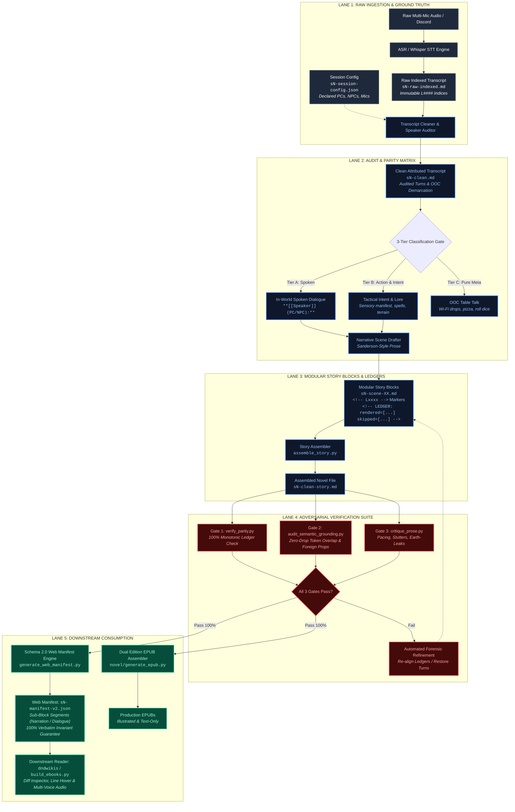

# 🏛️ Architecture Specification: Deterministic & Independent Transcript-to-Publishing Pipeline

## Executive Overview
The **D&D Scribe Publishing Engine** transforms raw, chaotic tabletop RPG session recordings and multi-speaker transcripts into high-fidelity fantasy novels, audiobooks, and web manifests.

To guarantee that the pipeline remains **strictly independent, non-biased, and deterministic**, the system enforces an adversarial gate architecture where no drafting agent evaluates its own output. Prose generation is decoupled from verification, and mathematical invariants govern every transformation.

---

## 🗺️ Pipeline Architecture: From Raw Audio to Polished Novel

---

## ⚖️ How We Maintain Independence, Objectivity & Determinism

### 1. Separation of Concerns (Adversarial Decoupling)
* **The Drafter Never Grades Its Own Paper:** The LLM agents that draft or compress scenes do not write the verification scripts or pass/fail decisions.
* **Deterministic Mathematical Assertions:** Automated gates ([`verify_parity.py`](file:///d:/Code/dnd-scribe/sessions/_scripts/verify_parity.py), [`audit_semantic_grounding.py`](file:///d:/Code/dnd-scribe/sessions/_scripts/audit_semantic_grounding.py), [`verify_manifest.py`](file:///d:/Code/dnd-scribe/sessions/_scripts/verify_manifest.py)) run pure Python algorithms with zero model hallucinations:
  $$\text{Rendered Turns} \cup \text{Skipped Turns} = \text{All Expected Dialogue Turns}$$
  $$\text{Rendered Turns} \cap \text{Skipped Turns} = \emptyset$$
  Every single line in the raw transcript must be mathematically accounted for in monotonic sequence.

### 2. Zero Hallucination & Anti-Drift Guardrails
* **High-Risk Foreign Prop Checker:** Flags any modern or foreign object introduced into prose that does not exist in the raw transcript window (e.g., cars, helicopters, trucks, laptops).
* **Suspicious Cluster Skip Detection:** Automatically halts the pipeline if $\ge 5$ consecutive spoken lines are marked as `(ooc)` skips without justification, ensuring that casual character banter and worldbuilding cannot be silently dropped.
* **Semantic Token Overlap:** For every rendered marker `<!-- Lxxxx -->`, the auditor computes the set intersection of lemmatized, non-stopword tokens between the prose paragraph and a 7-line window in the raw transcript. If token overlap is 0, the build fails with `UNGROUNDED TURN`.

### 3. Downstream Verbatim Contract
* Downstream readers (`dndwikis`, EPUB readers, ElevenLabs TTS pipelines) require exact speaker coloring, line provenance, and sub-block segmentation without risking text mutation.
* **The 100% Verbatim Invariant:**
  $$\sum_{s \in \text{block.segments}} s.\text{text} \equiv \text{block}.\text{text}$$
  Decomposing a paragraph into `"narration"` and `"dialogue"` must reconstruct the original block character-for-character, preserving exact whitespace, em-dashes, and punctuation.

---

## 🔍 Post-Mortem & Failures Experienced (Cross-Referenced with [`CRITIQUE_LOG.md`](file:///d:/Code/dnd-scribe/CRITIQUE_LOG.md))

Our pipeline hardened through resolving real-world failures tracked in [`CRITIQUE_LOG.md`](file:///d:/Code/dnd-scribe/CRITIQUE_LOG.md) and [`sessions/data/critiques/CRITIQUE_LOG.md`](file:///d:/Code/dnd-scribe/sessions/data/critiques/CRITIQUE_LOG.md):

### 1. The "Green Ford Truck" Infiltration Failure (Session 3)
* **Reference:** [`CRITIQUE_LOG.md: PR Record #002`](file:///d:/Code/dnd-scribe/CRITIQUE_LOG.md#L35-L56)
* **Failure Mode:** In early drafting, an upstream agent hallucinated the party driving a modern green Ford farm truck on an asphalt highway to Raleigh, completely erasing the canonical interdimensional travel.
* **Tabletop Ground Truth:** The party entered the **Lost Roads via Theodore's maintenance shed**, met **Ally (Maiden of Persephone)**, and emerged inside the **North Carolina Museum of History broom closet**.
* **Remediation & Permanent Gate:**
  - Added the `HIGH_RISK_FOREIGN_PROPS` filter in [`audit_semantic_grounding.py`](file:///d:/Code/dnd-scribe/sessions/_scripts/audit_semantic_grounding.py) scanning for modern anachronisms (`"truck"`, `"ford"`, `"chevy"`, `"smartphone"`).
  - Added Tier B Lore Drop tracking (`tier_b_pattern`) to prohibit skipping critical keywords (`"lost roads"`, `"maintenance shed"`, `"limestone stele"`).

### 2. Speech-to-Text Phonetic Accent Mergers (Session 1 & Session 3)
* **References:** 
  - *Versailles to Paris:* [`CRITIQUE_LOG.md: PR Record #001`](file:///d:/Code/dnd-scribe/CRITIQUE_LOG.md#L19-L32)
  - *Nincy vs. Nancy:* [`sessions/data/critiques/CRITIQUE_LOG.md: PR Record #003`](file:///d:/Code/dnd-scribe/sessions/data/critiques/CRITIQUE_LOG.md#L9-L24)
* **Failure Mode:** Automatic speech-to-text transcribed Pierre saying *"Versailles to Brittany"* because of hard French phonemes (*"Pair-ey"*), and transcribed the museum receptionist as *"Nancy"* despite her explicit dialogue: *"Nincy with an I... N-I-N-C-Y... Some people with my accent, they don't hear."*
* **Remediation & Permanent Gate:**
  - Created [`audit_transcript_gaps.py`](file:///d:/Code/dnd-scribe/sessions/_scripts/audit_transcript_gaps.py) to harvest self-referential spelling patterns (`"with my accent"`, `"N-I-N-C-Y"`).
  - Introduced `PHONETIC_ALIASES` in [`audit_semantic_grounding.py`](file:///d:/Code/dnd-scribe/sessions/_scripts/audit_semantic_grounding.py) so legitimate phonetic corrections pass semantic grounding with 100% confidence.

### 3. Micro-Chapter Fragmentation & Pacing Collapse (Session 2 & Session 3)
* **References:** 
  - *Micro-Chapter Bloat:* [`sessions/data/critiques/CRITIQUE_LOG.md: PR Record #003`](file:///d:/Code/dnd-scribe/sessions/data/critiques/CRITIQUE_LOG.md#L23)
* **Failure Mode:** Every 100-line scene block originally declared a `## CHAPTER` header. This fragmented single narrative conversations into 10–12 micro-chapters (some under 60 words), destroying reading momentum.
* **Remediation & Permanent Gate:**
  - Added Chapter Pacing & Word Count gates in [`novel/generate_epub.py`](file:///d:/Code/dnd-scribe/novel/generate_epub.py) and [`sessions/_scripts/harness/macro_auditor.py`](file:///d:/Code/dnd-scribe/sessions/_scripts/harness/macro_auditor.py).
  - Emits **`[MICRO_CHAPTER_FRAGMENTATION]`** for chapters $< 250$ words and **`[EXCESSIVE_CHAPTER_SPLIT]`** for sessions with $> 6$ chapters.
  - Successfully consolidated Session 2 and Session 3 into 3 breathing novel chapters each (averaging 2,000–3,000 words).

### 4. False Uncoupling from Unicode Ligatures & Missing Tags
* **Failure Mode:** Raw transcripts generated with Unicode ligatures (`\ufb01` for $\text{fi}$, `\ufb02` for $\text{fl}$) caused string comparisons to fail on common words like `"figure"`, falsely triggering `UNGROUNDED TURN`. Additionally, players speaking without `(PC/NPC)` tags (e.g. `**Luke Foreman:**`) were ignored by older regex patterns.
* **Remediation:**
  - Upgraded [`clean_lines()`](file:///d:/Code/dnd-scribe/sessions/_scripts/audit_semantic_grounding.py#L40-L50) to normalize all input text with `unicodedata.normalize("NFKD", ...)`.
  - Expanded dialogue regex to capture all player/GM speech patterns: `^\*\*([^*]+?)(?:\s*\((PC|NPC)\))?:\*\*\s*(.+)$`.

---

## 🎯 Downstream Artifact Contracts

| Downstream Target | Primary File | Schema / Invariants Enforced |
| :--- | :--- | :--- |
| **Web Manifest Engine** | `sessions/data/index/sN-manifest-v2.json` | Schema 2.0 with sub-block `segments[]`. Decomposes mixed text into `"dialogue"` and `"narration"`. Exact verbatim reconstruction check. |
| **EPUB Publishing** | `novel/the-margin-book-1-*.epub` | Dual editions (Illustrated & Text-Only). Strict chapter word count floors ($\ge 350$ words). Valid XHTML EPUB3 navigation. |
| **Audiobook & TTS Engine** | ElevenLabs Speech Pipeline | Granular speaker tagging per segment (`speakerId`). Exact quote boundary isolation eliminates cross-talk in multi-voice synthesis. |
| **Critique & Diff Inspector** | `dndwikis` / Web Diff Inspector | Monotonic line anchoring (`L0001`–`L9999`) allows readers to inspect the exact tabletop transcript turn behind any novel sentence. |
